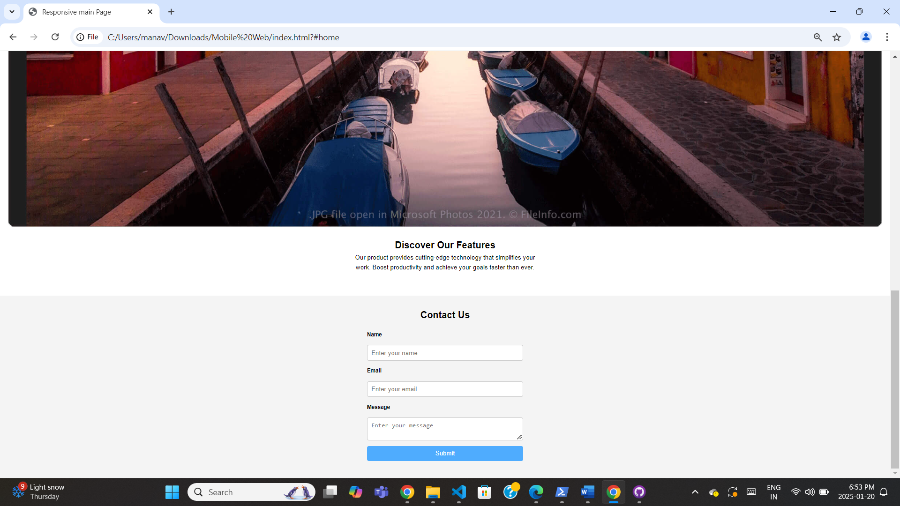
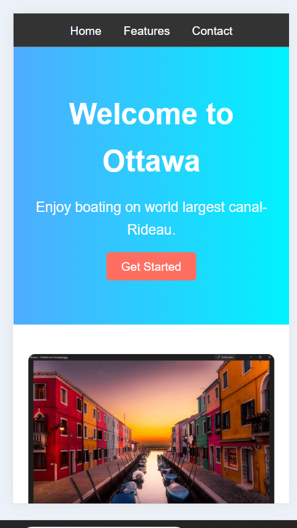
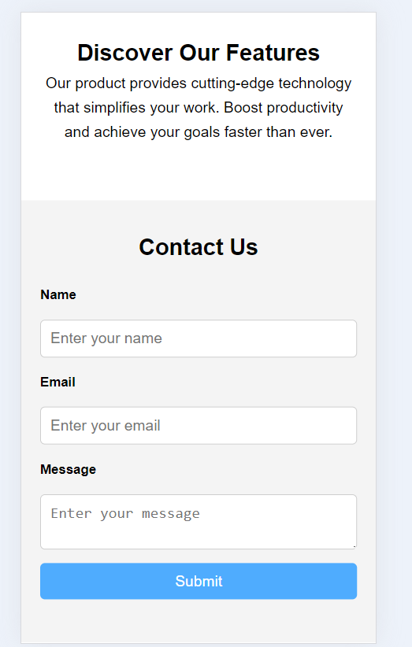

# Responsive Landing Page

This project is a simple and responsive landing page created for a fictional product or service. It showcases a modern design, mobile responsiveness, and interactive features using vanilla JavaScript.

## Features

### 🌟 **Mobile Responsive Design**
- Navigation bar with links to "Home," "Features," and "Contact."
- Hero section with a headline, subheadline, and call-to-action button.
- Two-column "Features" section with an image and description.
- Fully responsive layout using CSS Flexbox and media queries.

### 🛠️ **Interactive Contact Form**
- Form fields for "Name," "Email," and "Message."
- Validation using vanilla JavaScript to ensure:
  - All fields are filled.
  - Email format is valid.
- Displays error messages for invalid input and a success message upon correct submission.

## Screenshots

### Desktop View


### Mobile View



## Technologies Used

- **HTML**: Structure of the webpage.
- **CSS**: Styling and responsiveness (Flexbox and media queries).
- **JavaScript**: Interactive form validation.

## Installation

To run this project locally, follow these steps:

1. Clone the repository:
   ```bash
   git clone https://github.com/manavpatel1310/Mobile-Web.git
